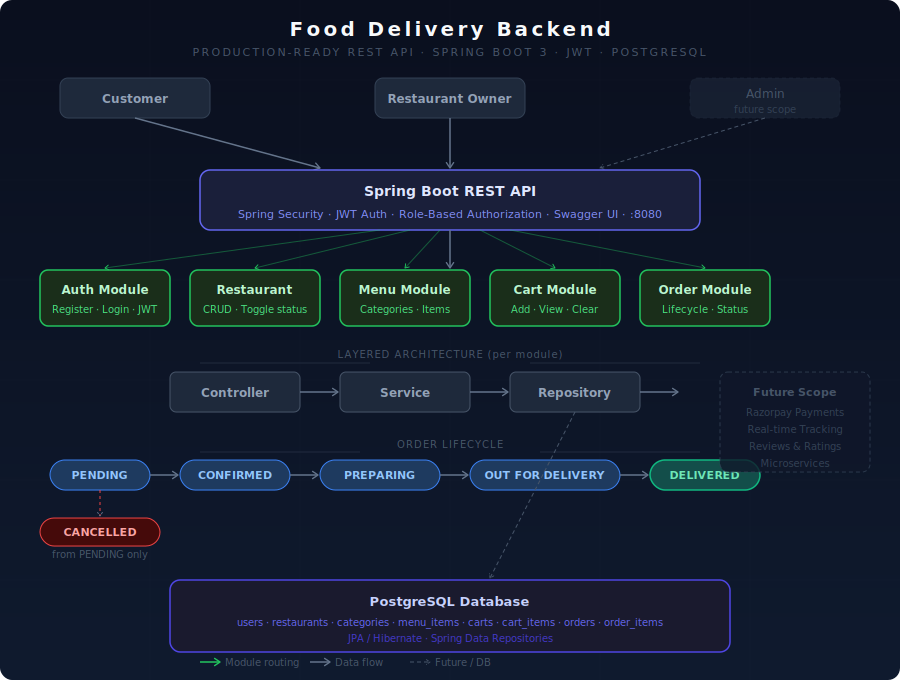

# 🍕 Food Delivery Backend

> A production-ready REST API for a food delivery platform (Swiggy/Zomato-style), built with Java Spring Boot 3. Supports multi-role authentication, full order lifecycle management, restaurant & menu CRUD, and cart operations.


---

## Architecture



The API follows a **modular layered architecture** — each domain (Auth, Restaurant, Menu, Cart, Orders) is a self-contained module with its own Controller → Service → Repository stack, all backed by a single PostgreSQL database via JPA/Hibernate.

---

## Tech Stack

| Layer | Technology |
|---|---|
| Language | Java 17 |
| Framework | Spring Boot 3 |
| Security | Spring Security + JWT |
| ORM | Spring Data JPA / Hibernate |
| Database | PostgreSQL |
| Validation | Jakarta Bean Validation (`@Valid`) |
| API Docs | Swagger / OpenAPI 3 |
| Build Tool | Maven |

---

## User Roles & Permissions

| Role | Permissions |
|---|---|
| `CUSTOMER` | Browse restaurants, manage cart, place & cancel orders |
| `RESTAURANT_OWNER` | Manage restaurants, menu items, update order status |
| `DELIVERY_AGENT` | *(Future scope)* Accept & track deliveries |
| `ADMIN` | *(Future scope)* Platform-level management |

---

## Security

- **JWT Authentication** — Stateless, token-based auth
- **Role-Based Authorization** — `@PreAuthorize` on every sensitive endpoint
- **BCrypt Password Encoding** — Passwords never stored in plain text
- **Input Validation** — `@Valid` + `@NotBlank` on all request DTOs

---

## API Endpoints

### Auth

| Method | Endpoint | Access | Description |
|---|---|---|---|
| POST | `/api/auth/register` | Public | Register new user |
| POST | `/api/auth/login` | Public | Login & get JWT token |
| GET | `/api/auth/me` | Authenticated | Get current user info |

### Restaurants

| Method | Endpoint | Access | Description |
|---|---|---|---|
| POST | `/api/restaurants` | RESTAURANT_OWNER | Add restaurant |
| GET | `/api/restaurants` | Public | Get all open restaurants |
| GET | `/api/restaurants/my` | RESTAURANT_OWNER | Get my restaurants |
| PUT | `/api/restaurants/{id}/toggle` | RESTAURANT_OWNER | Toggle open/close |

### Menu

| Method | Endpoint | Access | Description |
|---|---|---|---|
| POST | `/api/menu/category` | RESTAURANT_OWNER | Add category |
| GET | `/api/menu/category/restaurant/{id}` | Public | Get categories |
| POST | `/api/menu/item` | RESTAURANT_OWNER | Add menu item |
| GET | `/api/menu/restaurant/{id}` | Public | Get full menu |
| GET | `/api/menu/restaurant/{id}/available` | Public | Get available items only |
| PUT | `/api/menu/item/{id}/toggle` | RESTAURANT_OWNER | Toggle item availability |

### Cart

| Method | Endpoint | Access | Description |
|---|---|---|---|
| POST | `/api/cart/add` | Authenticated | Add item to cart |
| GET | `/api/cart` | Authenticated | View cart |
| DELETE | `/api/cart/item/{id}` | Authenticated | Remove item |
| DELETE | `/api/cart/clear` | Authenticated | Clear cart |

### Orders

| Method | Endpoint | Access | Description |
|---|---|---|---|
| POST | `/api/orders/place` | CUSTOMER | Place order from cart |
| GET | `/api/orders/my` | CUSTOMER | Get my orders |
| GET | `/api/orders/restaurant/{id}` | RESTAURANT_OWNER | Get restaurant orders |
| PUT | `/api/orders/{id}/status` | RESTAURANT_OWNER | Update order status |
| PUT | `/api/orders/{id}/cancel` | CUSTOMER | Cancel order |

---

## Order Lifecycle

```
PENDING → CONFIRMED → PREPARING → OUT_FOR_DELIVERY → DELIVERED
    ↓
CANCELLED  (only from PENDING state)
```

---

## Database Schema

```
users
restaurants  (owner_id → users)
categories   (restaurant_id → restaurants)
menu_items   (category_id → categories, restaurant_id → restaurants)
carts        (user_id → users, restaurant_id → restaurants)
cart_items   (cart_id → carts, menu_item_id → menu_items)
orders       (customer_id → users, restaurant_id → restaurants)
order_items  (order_id → orders, menu_item_id → menu_items)
```

---

## Getting Started

### Prerequisites

- Java 17+
- PostgreSQL
- Maven

### Steps

**1. Clone the repository**
```bash
git clone https://github.com/ritik-hedau18/food-delivery-backend.git
cd food-delivery-backend
```

**2. Create PostgreSQL database**
```sql
CREATE DATABASE food_delivery_db;
```

**3. Configure `src/main/resources/application.properties`**
```properties
spring.datasource.url=jdbc:postgresql://localhost:5432/food_delivery_db
spring.datasource.username=postgres
spring.datasource.password=your_password
spring.jpa.hibernate.ddl-auto=update
```

**4. Run the application**
```bash
mvn spring-boot:run
```

**5. API is live at**
```
http://localhost:8080
```

---

## API Documentation (Swagger UI)

Interactive API docs — test all endpoints directly from the browser:

```
http://localhost:8080/swagger-ui/index.html
```

> JWT-protected endpoints require a Bearer token. Login first via `/api/auth/login`, then click **Authorize** in Swagger and paste your token.

---

## Project Structure

```
food-delivery-backend/
│
├── auth/           → Register, Login, JWT issuance
├── restaurant/     → Restaurant management
├── menu/           → Categories & Menu items
├── cart/           → Cart management
├── order/          → Order lifecycle & status
└── config/         → Security, JWT filter, Exception handling
```

Each module follows:
```
controller/   → REST endpoints
service/      → Business logic
repository/   → JPA queries
dto/          → Request/Response objects
entity/       → JPA database entities
```

---

## Future Scope

- [ ] Payment integration (Razorpay / Stripe)
- [ ] Real-time delivery tracking (WebSockets)
- [ ] Reviews & Ratings
- [ ] Push notifications
- [ ] Microservices migration

---

## Author

**Ritik Hedau** — Java Backend Developer

[](https://github.com/ritik-hedau18)